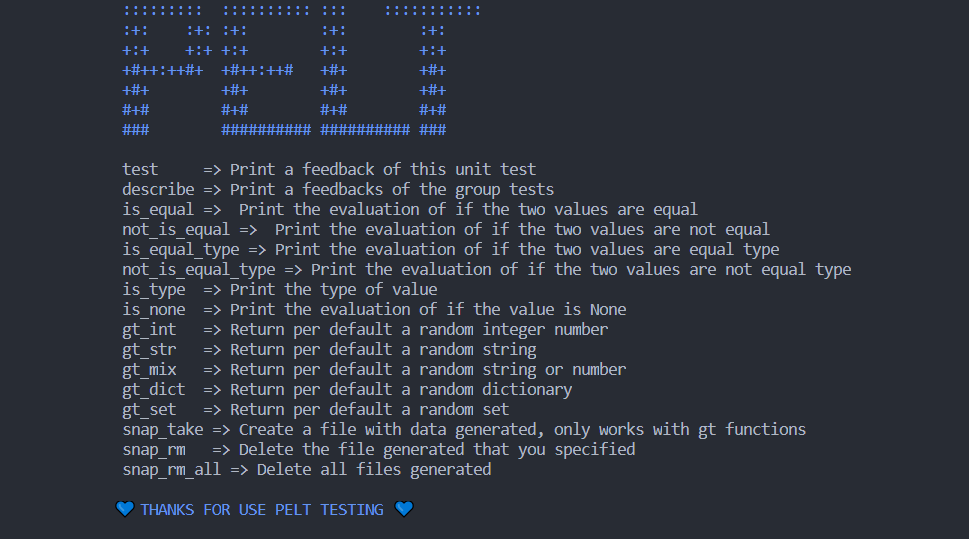

# PELT TESTING

Pelt is a library for testing your algorithms and generate 
various data type for these algorithm of differents ways.

## Usage

### Help

This function provides a summary of all the methods that Pelt has

*Example:*

`
Pelt.help()
`

*output:*

